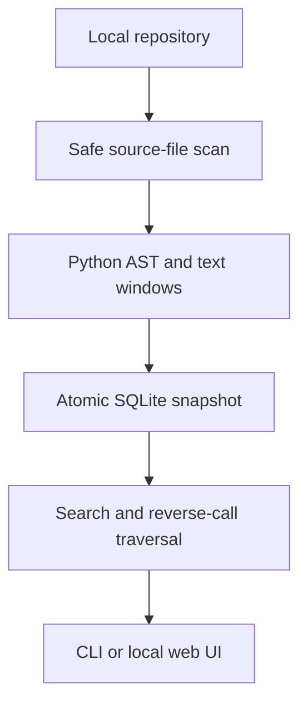

# CodeAtlas

**Find the code. Follow the connections.**

CodeAtlas indexes a local repository, searches source with exact file and line references, and traces Python callers that may be affected by a symbol change. Its Python AST index connects imported functions, nested definitions, and `self`/`cls` method calls. Optional dense embeddings add semantic retrieval alongside BM25.

This is a working portfolio MVP with a local web interface, CLI, JSON API, SQLite snapshots, reproducible toy evaluations, and CI. Static impact analysis is approximate; it is not a compiler or complete dependency analyzer.

## Quick start

Requires Python 3.11+. The default demo has **no third-party dependencies**.

```bash
git clone https://github.com/daimich/codeatlas.git
cd codeatlas
python -m codeatlas index examples/sample_repo
python -m codeatlas serve
```

Open **http://127.0.0.1:8081**, search for “Validate bearer token,” and select **Trace callers** on a function result.

If you downloaded the source archive, extract it and start at `cd codeatlas`; cloning requires the remote repository to exist.

```bash
python -m codeatlas search "Authenticate request Authorization header"
python -m codeatlas impact auth.verify_token --depth 3
python -m codeatlas eval
python -m unittest discover -s tests -v
```

For an installed CLI, run `python -m pip install .`, then use `codeatlas` in place of `python -m codeatlas`. Windows users may use `py` in place of `python`.

## Index your repository

```bash
python -m codeatlas index /path/to/repository
python -m codeatlas search "Where are invoices created?"
python -m codeatlas status
python -m codeatlas serve
```

Reindex and restart the server after changing source files. Indexing replaces the entire snapshot in one transaction, so removed symbols cannot linger. File hashes are retained as metadata; incremental indexing is a planned extension, not implemented yet.

| Capability | Implementation |
|---|---|
| Python structure | AST functions, classes, nested qualified names, docstrings, source ranges |
| Other languages | Text windows for JS/TS, Go, Rust, Java, C/C++, and Markdown |
| Retrieval | BM25 with identifier splitting; optional dense embeddings fused with reciprocal rank fusion |
| Call resolution | Lexical names, explicit imports/aliases, and `self`/`cls` calls where a target is indexed |
| Impact | Breadth-first reverse-call traversal; depth limit and cycle detection |
| Provenance | Original source paths, 1-based line ranges, and exact stored excerpts |
| Repository hygiene | Git-tracked/unignored source files, size limits, generated-directory and symlink exclusions |
| Persistence | Atomic SQLite snapshots, including warnings and unresolved calls |

## Optional semantic retrieval

```bash
python -m pip install '.[semantic]'
python -m codeatlas --semantic-model sentence-transformers/all-MiniLM-L6-v2 search "Who verifies the identity of incoming callers?"
python -m codeatlas --semantic-model sentence-transformers/all-MiniLM-L6-v2 serve
```

The first model load may download weights. A local model directory also works. The bundled example model is a general text embedding model, not a code-specialized model; evaluate its suitability on your repositories. Default BM25 mode does not use embeddings.

## Example impact result

Changing `auth.verify_token` in the fixture identifies:

| Caller | Distance |
|---|---:|
| `auth.authenticate_request` | 1 |
| `api.handle_invoice` | 2 |

Use an exact symbol ID from search if a short name matches multiple symbols. Dynamic dispatch, monkey patching, shadowed imports, inheritance, external callers, and runtime control flow are not fully resolved. The graph can have false positives and false negatives; confirm results in source.

## Architecture



See [architecture and tradeoffs](docs/architecture.md), [API examples](docs/api.md), and [development roadmap](docs/roadmap.md).

## Docker demo

```bash
docker build -t codeatlas .
docker run --rm -p 127.0.0.1:8081:8081 codeatlas
```

The container starts with the sample repository. The Docker build and real model downloads have not been validated in the initial development environment.

## Evaluation and validation

`eval` reports Recall@5 and MRR@5 on six toy symbol queries. Index the sample repository first. These fixtures do not demonstrate general code comprehension or production performance. Tests cover call resolution, relative imports, line ranges, cycle handling, ambiguous names, reindex deletion, Git ignores, symlink exclusions, syntax fallback, HTTP requests, and ensuring repository code is never executed.

## Operating limits

Source files are parsed as data, never imported or executed. Sensitive-path exclusions are a convenience, not a secret scanner; reviewed files can still contain secrets. Index only repositories you are authorized to inspect. The demo HTTP server has no multi-user authentication or TLS and binds to loopback by default. Retrieval scans records in memory; large-corpus indexing, ANN search, incremental updates, and non-Python syntax graphs are future work.

MIT licensed. The fixture repository contains fictional demonstration code.
